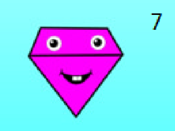

# Organizacja

- 12 sprawozdań
- Trzeba wszystkie oddać
- Obrona na następnych zajęciach jest opcjonalna, ale bez obrony jest tylko 3 w przypadku samego odesłania

Operator porównania == - porównanie wartości
Operator porównania === - porównanie wartości oraz typu

## Biblioteki, środowiska
- Używamy JS (+ OpenGL?) 
- Canvas (JS)

## Co dziś do roboty

1. Zrobić w canvasie ten wzór

